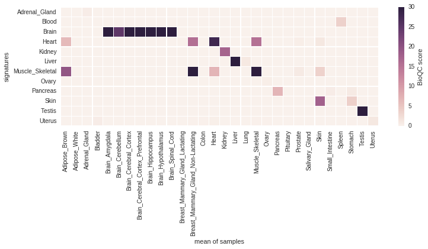

# Validating Tissue Signatures {#validating-signatures}

The authors of *BioQC* have taken three independent approaches to show that their signatures are valid and biologically meaningful. However, they did not break down the predictive performance (*i.e.* is the signature able to identify its tissue) of each signature with quantitative performance measures. 

To address this, we independently derived signatures on the [GTEx](http://gtexportal.org) dataset using *gini-index*.  and performed both a 10-fold cross validation on the same dataset and a cross-species, cross-platform validation on the [mouseGNF](https://www.ncbi.nlm.nih.gov/geo/query/acc.cgi?acc=GSE10246). To this end, we developed the python package [pygenesig](https://github.com/grst/pygenesig), a framework to create and validate signatures. 

In this chapter, we

 * perform a 10-fold cross-validation on the GTEx dataset, calculating the precision and recall for each signature. 
 * perform a cross-species, cross-platform validation of the signatures generated on the GTEx dataset
 * identify a set of tissues, that can be reliably and unabmigously identified with the *BioQC* method. 


## Data
 * The [**Genotype Tissue Expression (GTEx)**](http://gtexportal.org) project is a comprehensive resource of tissue-specific gene expression data. We use this dataset to derive tissue-specific signatures. The data is human only and was generated using Illumina sequencing. 
 * We use the [**GNF Mouse GeneAtlas V3**](https://www.ncbi.nlm.nih.gov/geo/query/acc.cgi?acc=GSE10246) as a control dataset to demonstrate that the gini-method is robust over multiple platforms and species. This dataset originates from mouse and was generated using the *Affymetrix Mouse Genome 430 2.0 Array (GPL1261)*.
    
## Cross-Validation of signatures on the GTEx dataset 
We use [pygenesig-pipline](https://github.com/grst/pygenesig-pipeline) to create and validate signatures on the GTEx v6 dataset. The data preparation steps are performed using these [jupyter notebooks](https://github.com/grst/pygenesig-example/tree/d88e4a81a45e192527a84a4445094604deba580b/notebooks/prepare_data). The output of *pygenesig-pipeline* can be viewed [here](https://github.com/grst/BioQC_GEO_analysis/blob/aa0fcd86bbdfbd49c9a4a10ce0be1c22895cc957/notebooks/gtex_v6_gini.ipynb). Below, we summarize the prodecues described in these documents. 

We obtained the gene expression data and sample annotation from the [GTEx portal](http://gtexportal.org). We collapsed gene expression data by HGNC symbol, aggregating by the sum. 

We performed a 10-fold cross-validation as follows: 
We split samples in 10 [stratified folds](http://scikit-learn.org/stable/modules/generated/sklearn.model_selection.StratifiedKFold.html), *i.e.* samples from all tissues are equally distributed across all folds. We use 9 folds to generate signatures using the [gini method](https://grst.github.io/pygenesig/apidoc.html#module-pygenesig.gini) as described by the BioQC authors. These signatures were applied to the remaining fold using BioQC. We iterated over the folds such that each fold has been used for training and testing. 

The following heatmap shows the average BioQC score over all folds for each signature and each tissue.

```{r, echo=FALSE, fig.cap="cross-validation of GTEx tissue signatures. Signatures are shown on the y-axis, the corresponding groups of samples on the x-axis. The tile shading indicates the average BioQC score of a signature on a group of samples. For better visibility of low scores, the colors are saturated at 30."}
knitr::include_graphics("signature_validation/gtex_v6_xval_scores.png")
```

As identifying contaminated/mislabled samples can be boiled down to a classification exercise, we are interested in the predictive performance of each signature. The following heatmap shows the confusion matrix of using the signatures for classification. A sample is considered as classified as a tissue, if the corresponding signature scores highest among all other signatures. 

```{r, echo=FALSE, fig.cap="Confusion matrix of the cross-validation"}
knitr::include_graphics("ssignature_validation/gtex_v6_xval_classification.png")
```

## 'solid' signatures
From the above matrices we learn that, while the vast majority of signatures yield a high score in the corresponding tissue, an unambigous classification of tissues is only viable for a subset of tissues. 
For instance, the different brain regions are hard to distinguish and so are physiologically close tissues (e.g. large and small intestine). 

Here, we reduce the dataset to a subset of tissues, which can be unambigously distinguished using the BioQC method (*i.e.* precision = recall = 1.0). 

We [manually map](https://github.com/grst/pygenesig-example/blob/d88e4a81a45e192527a84a4445094604deba580b/manual_annotation/gtex_solid.csv) 
the tissues from GTEx to a reduced subset of tissue names. The data [is prepared](https://github.com/grst/pygenesig-example/blob/d88e4a81a45e192527a84a4445094604deba580b/notebooks/gtex_solid.ipynb)
to be ran using *pygenesig-pipeline*. The results are available in [this jupyter notebook](https://github.com/grst/BioQC_GEO_analysis/blob/b11987da13ba9b98eba34206f92942be8de6427e/signature_validation/gtex_v6_gini_solid.ipynb)
and summarized below. 

Again, the following heatmap shows the confusion matrix. 

```{r, echo=FALSE}
knitr::include_graphics("ssignature_validation/gtex_v6_solid_xval_classification.png")
```

All tissues have been correctly identified at Precision = Recall = 1.0. 


## Cross-Platform Cross-Species validation
Arguably, in the above experiment, we could have built signatures based on human-specific genes, genes that can only be detected by a certain experimental platform or even experiment-specific batch effects instead of univerally translatable marker genes. 

To asses the translatability of the signatures, we tested the signatures generated above (human, Illumina sequencing) on the *mouseGNF tissue expression atlas* (mouse, Affymetrix microarray). Te procedure is described in [this notebook](https://github.com/grst/pygenesig-example/blob/80bfe2a388a5230b004c288cb2ea220f0394855d/notebooks/gtex_solid_vs_mouse_gnf.ipynb).

The following figure shows the score matrix of GTEx signatures against mouseGNF samples:

```{r, echo=FALSE}

```

The signatures *Brain, Heart, Kidney, Liver, Skeletal Muscle, Pancreas, Skin* and *Testis* identify the respective tissue despite the species and platform differences at a high (>5) BioQC score. 

As expected *Heart* and *Skeletal muscle* also identify each other, however *Heart* scores still higher on heart samples and *Skeletal muscle* scores higher on skeletal muscles samples, therefore we retain both signatures. 

Surprisingly, *Adrenal Gland*, *Ovary* and *Uterus* are not able to identify the respective samples, despite having a high score in the cross-validation. We therefore exclude these signatures from the 'gtex solid' signature set. 

Unfortunately, *Blood* was not profiled in the mouseGNF dataset. We keep the signature nonetheless as it does not trigger any false positives. 

