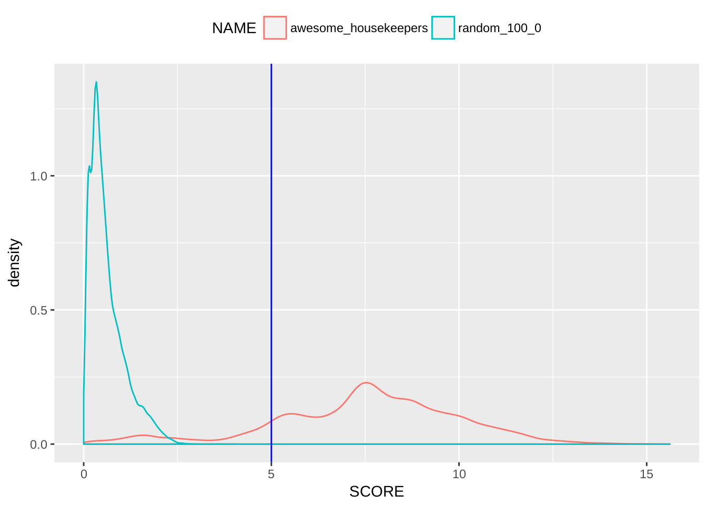

## Sample Processing with BioQC {#sample-processing}


The following processes are ressource intensive, therefore we execute them on a high performance cluster (HPC). We use [chunksub](https://github.com/grst/chunksub) to distribute the [list of sample ids](#sample-list) to the workers. This involves four major steps which are also documented in the project's [Makefile](https://github.com/grst/BioQC_GEO_analysis/blob/master/Makefile).

1. We download the studies with [GEOquery](https://bioconductor.org/packages/release/bioc/html/GEOquery.html) and store them as R [ExpressionSet](https://bioconductor.org/packages/devel/bioc/vignettes/Biobase/inst/doc/ExpressionSetIntroduction.pdf) using the R script [geo_to_eset.R](https://github.com/grst/BioQC_GEO_analysis/blob/master/scripts/geo_to_eset.R). For some series, the download is not successful.
2. We annotated human orthologous genes for all studies using [ribiosAnnotation](https://github.com/Accio/ribios) in [annotate_eset.R](https://github.com/grst/BioQC_GEO_analysis/blob/master/scripts/annotate_eset.R). This is necessary as the tissue signatures are built on a human dataset. The annotation failes for species which are not in the *ribios* database.
3. We run *BioQC* on these studies use [run_bioqc.R](https://github.com/grst/BioQC_GEO_analysis/blob/master/scripts/run_bioqc.R).
4. Finally, [import the BioQC results into the database](#import-bioqc-results).


## Sample Post-selection

The failures during download and annotation reduce the number of samples available to our study.

<!-- since there are muliple gpl and gsm in a gse, there might've been some gsm
inserted, that don't have a tissue annotated, although the gse was selected. -->


```r
count_gse_gsm = function(tbl) {
  summarise(tbl, GSM=n_distinct(GSM), GSE=n_distinct(GSE))
}

tmp_tbl = bioqc_bioqc_success %>%
  inner_join(bioqc_gsm, by=c("GSM"="GSM")) %>%
  inner_join(bioqc_gse_gsm, by=c("GSM"="GSM"))

tmp_tbl %>%
  count_gse_gsm() %>%
  kable()
```

    GSM    GSE
-------  -----
 253210   8083


### Excluding multi-channel microarrays

Multi channel microarrays date back to the early age of gene expression studies. They don't provide absolute gene expression data and are not meaningful outside their experimental context. We therefore exclude these experiments:

```r
tmp_tbl2 = tmp_tbl %>%
  filter(CHANNEL_COUNT == 1)

tmp_tbl2 %>%
  count_gse_gsm() %>%
  kable()
```

    GSM    GSE
-------  -----
 235237   7561

### Exclude non-mapped tissues
We exclude samples that have a tissue annotated, but it is not mapped to a [normalized tissue](#tissue-normalization).


```r
tmp_tbl3 = tmp_tbl2 %>%
  mutate(TISSUE_ORIG=tolower(TISSUE_ORIG)) %>%
  inner_join(bioqc_normalize_tissues, by=c("TISSUE_ORIG"="TISSUE_ORIG"))

tmp_tbl3 %>%
  count_gse_gsm() %>%
  kable()
```

    GSM    GSE
-------  -----
 136230   3800

### Select organisms
We were interested in the organism distribution.

```r
tmp_tbl3 %>%
  group_by(ORGANISM_CH1) %>%
  count_gse_gsm() %>%
  arrange(-GSM) %>%
  kable()
```


ORGANISM_CH1                                  GSM    GSE
-----------------------------------------  ------  -----
Homo sapiens                                66316   1228
Mus musculus                                38109   2270
Rattus norvegicus                           29909    278
Macaca mulatta                               1082     24
Macaca fascicularis                           259      7
Mus musculus musculus x M. m. domesticus      202      2
Cercocebus atys                                80      2
Oryctolagus cuniculus                          57      1
Chlorocebus aethiops                           36      1
Mus musculus domesticus                        32      3
Pan troglodytes                                25      1
Papio cynocephalus                             23      1
Mus spretus                                    19      1
Capra hircus                                   18      1
Phodopus sungorus                              16      1
Mus musculus musculus x M. m. castaneus        12      1
Papio hamadryas                                12      1
Macaca nemestrina                               8      1
Mus musculus castaneus                          6      1
Mus musculus musculus                           6      1
Mus sp.                                         3      1

Results suggest that it makes sense to limit the analysis to the three main organisms: *H. sapiens*, *M. musculus*, *R. norvegicus*. This makes also sense as these species are closesly related and therefore the signatures are more likely to translate within these species.
We are left with the following amount of samples:


```r
tmp_tbl5 = tmp_tbl3 %>%
  filter(ORGANISM_CH1 %in% c('Homo sapiens', 'Mus musculus', 'Rattus norvegicus'))

tmp_tbl5 %>%
  count_gse_gsm() %>%
  kable()
```

    GSM    GSE
-------  -----
 134334   3757

### Quality control

In this step we seek to identify studies on which BioQC cannot work due to poor data quality or data processing steps that remove the relative expression of a gene within a sample, e.g. per-gene normalization.
We will first filter samples by applying a cutoff-value to statistics on the gene expression data. Second, we will use an ubiquitous signature containing housekeeping genes as an indicator if BioQC returns a sensible result on the given sample.

On each study, we have calculated the mean of each gene over all samples. Of this series of means, we calculate the IQR. If a per-gene normalization has been applied, this value should be close to zero. This histogram shows a distribution of all IQRs over all remaining studies:


```r
tbl_hist = tmp_tbl5 %>%
  inner_join(bioqc_gse_gpl, by=c("GSE"="GSE", "GPL"="GPL")) %>%
  mutate(IQR=abs(STUDY_75-STUDY_25))

sm = tbl_hist$IQR
hist(sm[sm > 0 & sm < 25],
     breaks=seq(0, 25, .25),
     main="Variance between gene for each study (IQR)",
     xlab="median gene expression (only values up to 25)")
abline(v=.5, col="blue")
minor.tick(nx=5)
```

<div class="figure">

<p class="caption">(\#fig:study_iqr)Histogram of the distribution of all inter quartile ranges of all studies remaining at this filtering step. The vertical line shows the filtering cutoff used. </p>
</div>

We exclude all studies having a very low variance between genes (IQR < 0.5). Remaining samples:


```r
tmp_tbl6 = tbl_hist %>%
  filter(IQR >= .5)

tmp_tbl6 %>%
  count_gse_gsm() %>%
  kable()
```


   GSM    GSE
------  -----
 94790   3128

Now, we have a look at the p-value distribution of the signature we called `awesome_housekeepers` containing ubiquitous genes. The gene expression of these genes can be assumed to be more or less constant over all tissue types, therefore this signature should score high in every sample.

**Awesome Housekeepers**


```r
tmp_bioqc_res = bioqc_signatures %>%
  filter(ID %in% c(56184, 56206)) %>% # awesome_housekeepers, random_100_0
  inner_join(bioqc_res, by=c("ID"="SIGNATURE")) %>%
  rename(SIGNATURE=ID)

tbl_hk = tmp_tbl6 %>%
  inner_join(tmp_bioqc_res, by=c("GSM"="GSM")) %>%
  mutate(SCORE=absLog10p(as.numeric(PVALUE)))
```

<div class="figure">

<p class="caption">(\#fig:unnamed-chunk-2)The orange curve is the pvalue distribution of the housekeeping signature. The blue curve shows the distribution of a random control signature containing 100 randomly chosen genes. The vertical line represents the p-value cutoff used in this filtering step</p>
</div>

We exclude all samples for which `awesome_housekeepers` scores with < 5, i.e. pvalue >= 1e-5.

```r
tmp_tbl7 = tbl_hk %>%
  filter(SIGNATURE == 56184) %>%
  filter(PVALUE < 1e-5)

tmp_tbl7 %>%
  count_gse_gsm() %>%
  kable()
```


   GSM    GSE
------  -----
 81207   2925

This is the 'background' of samples on which we test for tissue contamination.
We store the selected samples alongside with meta information required for the analysis in the materialized view `BIOQC_SELECTED_SAMPLES` in our DBS. [Here](https://github.com/grst/BioQC_GEO_analysis/blob/master/db/views/sample_selection.sql) is the SQL script generating the materialized view.


### Tissue abundance

The following table shows how many samples are available for each tissue:

```r
bioqc_selected_samples %>%
  group_by(TISSUE) %>%
  summarise(samples=n_distinct(GSM)) %>%
  arrange(-samples) %>%
  kable()
```


TISSUE                 samples
--------------------  --------
blood                    18064
liver                    12925
lung                      7586
bone marrow               3911
kidney                    3540
breast tumor              3465
brain                     3452
heart                     2402
spleen                    2302
adipose                   2214
skin                      1927
skeletal muscle           1830
hippocampus               1573
colon                     1463
lymph node                1120
cerebellum                1094
hepatocyte                1094
tumor                     1036
breast                     795
frontal cortex             729
placenta                   678
pbmc                       665
white blood cells          664
testis                     627
retina                     596
pancreas                   586
thymus                     551
pancreatic islets          488
ovary                      455
mammary gland              395
jejunum                    380
prostate                   330
hypothalamus               271
cortex                     256
prefrontal cortex          249
synovial tissue            234
uterus                     232
embryo                     217
monocyte                   162
stomach                    127
bladder                    123
cervix                      95
ventral midbrain            74
eye                         69
salivary gland              48
neuroblastoma               45
adrenal gland               39
fibroblast                  21
synovial fibroblast          8

## ARCHS4 RNA-seq data
In addition to GEO, we used data from
[ARCHS4](https://amp.pharm.mssm.edu/archs4/), a publicly available data
collection of annotaed, consistently processed gene expression datasets based
on RNA-sequencing.

We downloaded all human and mouse RNA-sequencing-based gene expression studies
that are available on SRA in which Illumina GA 2000 were used to sequence from
website of the ARCHS4 project (version 1.0). We filtered samples by the
following criteria: (1) transcriptomic cDNA library, (2) library strategy is
RNA-seq, (3) either polyA or total RNA were extracted, and (4) no less than
200,000 reads can be mapped to genes (or human orthologues in case of mouse
samples) with valid Entrez Gene ID. The filter removed less than 10% of samples
in either species (before/ after filtering: N=65429/ N=61455 for human, and
N=72363/ N=65392 for mouse)

The samples were processed in the same way as microarray studies from GEO (see
\@ref(sample-processing)).
Gene counts were normalised into FPKM values that were analysed by BioQC. Results were independently analysed using the same software pipeline in which the microarray data were processed. Reference tissues annotated by studies’ authors were compared with the predictions of BioQC.

