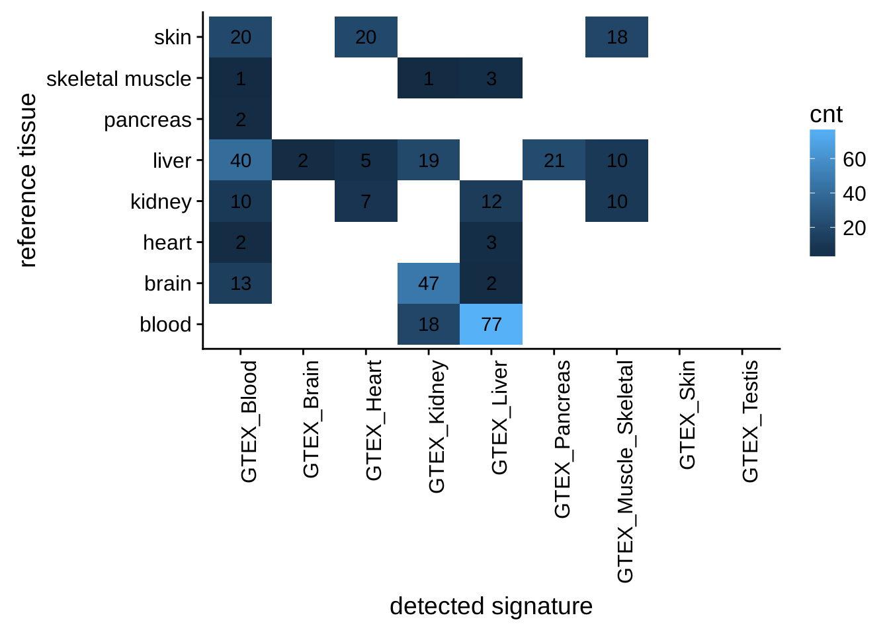
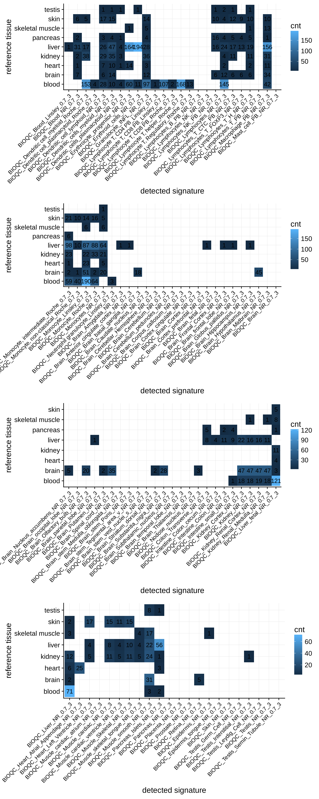
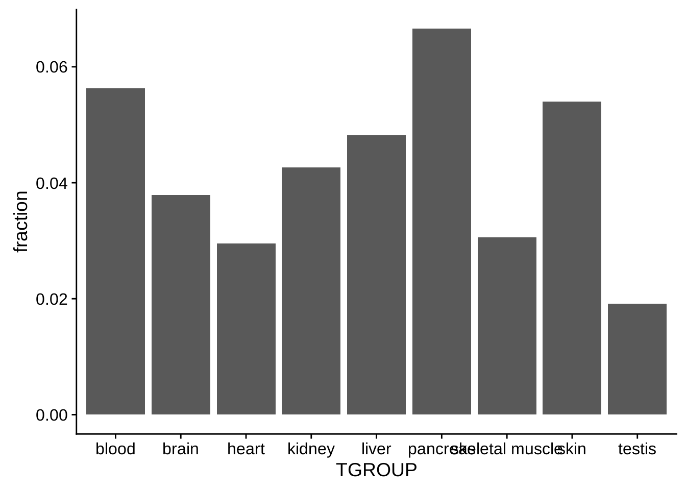

# Results
Results suggest, that between 2 and 6 percent of all samples in GEO show tissue heterogeneity. A major source of heterogeneity appear to be blood mononuclear cells.

Figure \@ref(fig:heterogeneitygtex) shows the number of samples detected as heterogenous with the reference signatures only. Figure \@ref(fig:heterogeneityall) shows the number of samples classified as heterogeneous with the signatures provided by BioQC. Figure \@ref(fig:heterogeneitybar) shows the fraction of heterogenous samples per tissue, taking all signatures into account.

(\#fig:heterogeneitygtex)Tissue heterogeneity assessed with the reference signatures. The annotated tissues are listed in rows, the significantly enriched signatures in columns. If a signature has been found to be significantly enriched in a sample, the sample will count towards the number indicated in the matrix. All contaminations per sample are included, *i.e.* a sample can appear multiple times in a row. 

(\#fig:heterogeneityall)Tissue heterogeneity assessed with the BioQC signatures. The annotated tissues are listed in rows, the significantly enriched signatures in columns. If a signature has been found to be significantly enriched in a sample, the sample will count towards the number indicated in the matrix. All contaminations per sample are included, *i.e.* a sample can appear multiple times in a row.

(\#fig:heterogeneitybar)Fraction of heterogenous samples per tissue. Heterogeneity has been assessed using both the reference signatures and the signatures from BioQC. A sample only counts once to the fraction, even if multiple signatures are found to be enriched. 

