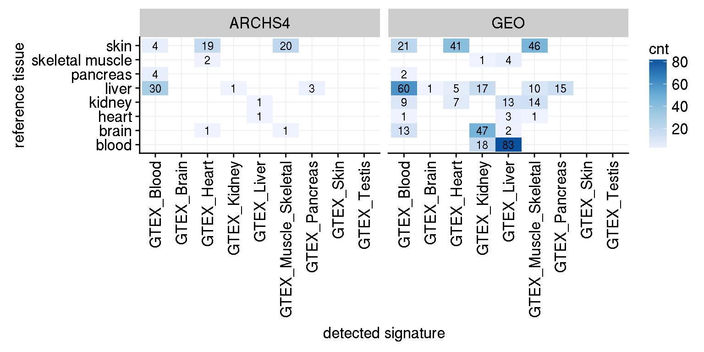
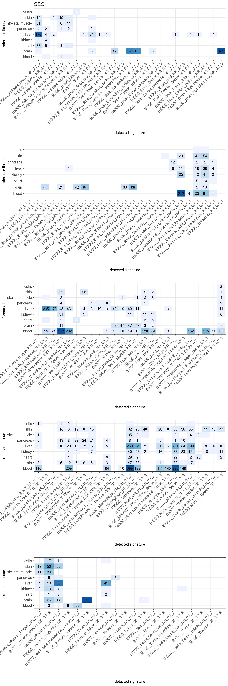
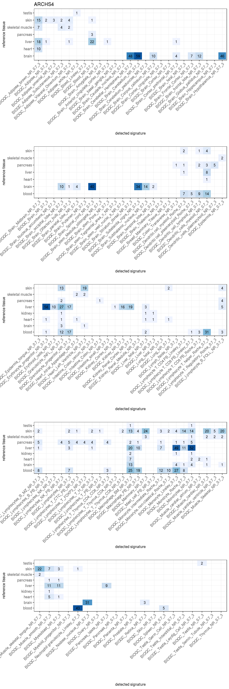

## Heterogeneity using GTEX signatures only


<div class="figure">

<p class="caption">(\#fig:heterogeneitygtex_fig)Tissue heterogeneity assessed with the reference signatures. The annotated tissues are listed in rows, the significantly enriched signatures in columns. If a signature has been found to be significantly enriched in a sample, the sample will count towards the number indicated in the matrix. All contaminations per sample are included, *i.e.* a sample can appear multiple times in a row. </p>
</div>

## Heterogeneity using all signatures

```
## [[1]]
```

<div class="figure">

<p class="caption">(\#fig:heterogeneityall)Tissue heterogeneity assessed with the BioQC signatures. The annotated tissues are listed in rows, the significantly enriched signatures in columns. If a signature has been found to be significantly enriched in a sample, the sample will count towards the number indicated in the matrix. All contaminations per sample are included, *i.e.* a sample can appear multiple times in a row.</p>
</div>

```
## 
## [[2]]
```

<div class="figure">

<p class="caption">(\#fig:heterogeneityall)Tissue heterogeneity assessed with the BioQC signatures. The annotated tissues are listed in rows, the significantly enriched signatures in columns. If a signature has been found to be significantly enriched in a sample, the sample will count towards the number indicated in the matrix. All contaminations per sample are included, *i.e.* a sample can appear multiple times in a row.</p>
</div>

