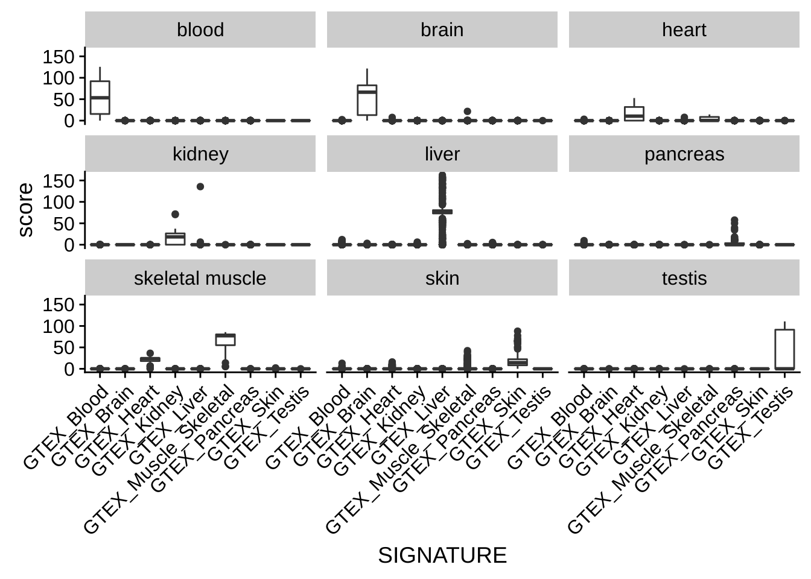
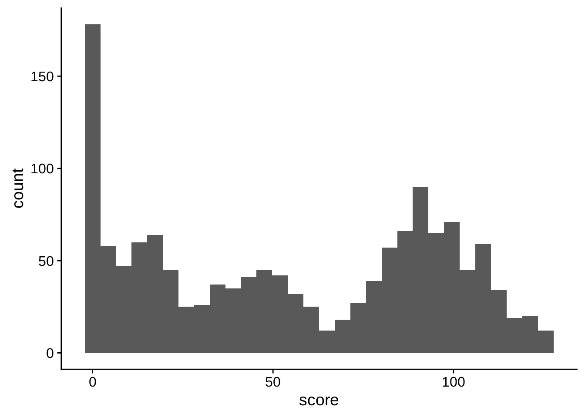
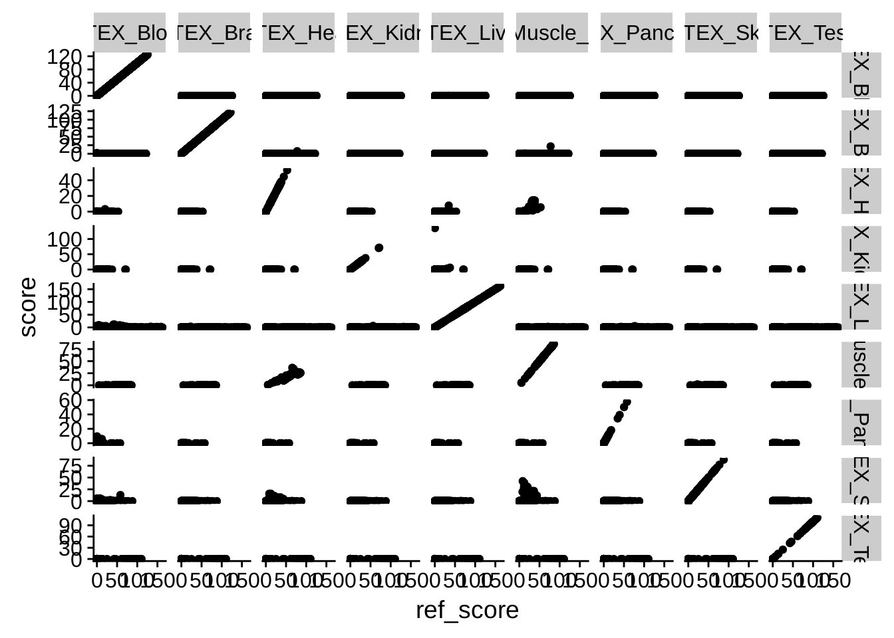
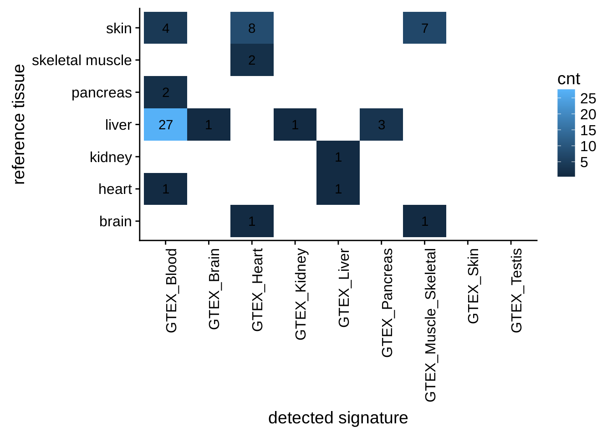
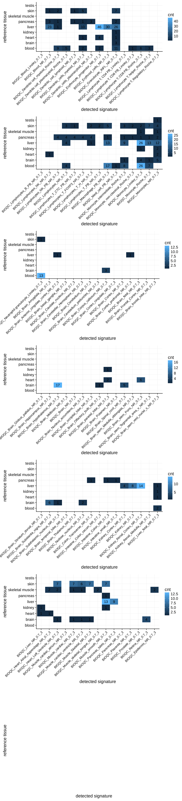
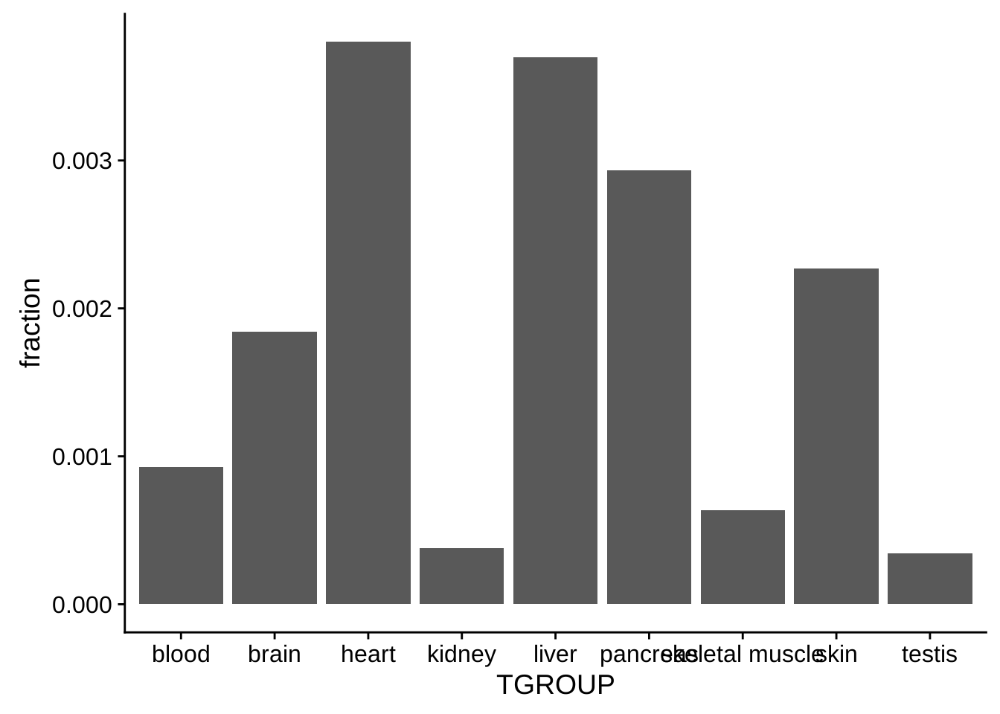

# Redo analysis for ARCHS4


## Quick plots to check if everything is ok

```r
ref_data = data2 %>% inner_join(select(reference_signatures, "REF_SIG"), by=c("SIGNATURE"="REF_SIG"))
ggplot(ref_data, aes(x=SIGNATURE, y=score)) + geom_boxplot() + facet_wrap(~TGROUP) + theme(axis.text.x = element_text(angle = 45, hjust = 1))
```



```r
ref_data %>% filter(TGROUP == "blood", SIGNATURE == 'GTEX_Blood') %>% ggplot(aes(x=score)) + geom_histogram()
```

```
## `stat_bin()` using `bins = 30`. Pick better value with `binwidth`.
```



```r
ref_data %>% ggplot(aes(x=ref_score, y=score)) + geom_point() + facet_grid(REF_SIG ~ SIGNATURE, scales="free")
```



## Sample count by tissue

```r
data2 %>% select(GSM, TGROUP) %>% group_by(TGROUP) %>% summarise(count = n_distinct(GSM))
```

```
## # A tibble: 9 x 2
##   TGROUP          count
##   <chr>           <int>
## 1 blood            1394
## 2 brain            1387
## 3 heart             413
## 4 kidney            143
## 5 liver            2378
## 6 pancreas          161
## 7 skeletal muscle   287
## 8 skin              636
## 9 testis            117
```


## same analysis...
<div class="figure">

<p class="caption">(\#fig:heterogeneitygtex2)Tissue heterogeneity assessed with the reference signatures. The annotated tissues are listed in rows, the significantly enriched signatures in columns. If a signature has been found to be significantly enriched in a sample, the sample will count towards the number indicated in the matrix. All contaminations per sample are included, *i.e.* a sample can appear multiple times in a row. </p>
</div>

<div class="figure">

<p class="caption">(\#fig:heterogeneityall2)Tissue heterogeneity assessed with the BioQC signatures. The annotated tissues are listed in rows, the significantly enriched signatures in columns. If a signature has been found to be significantly enriched in a sample, the sample will count towards the number indicated in the matrix. All contaminations per sample are included, *i.e.* a sample can appear multiple times in a row.</p>
</div>

<div class="figure">

<p class="caption">(\#fig:heterogeneitybar)Fraction of heterogenous samples per tissue. Heterogeneity has been assessed using both the reference signatures and the signatures from BioQC. A sample only counts once to the fraction, even if multiple signatures are found to be enriched. </p>
</div>
