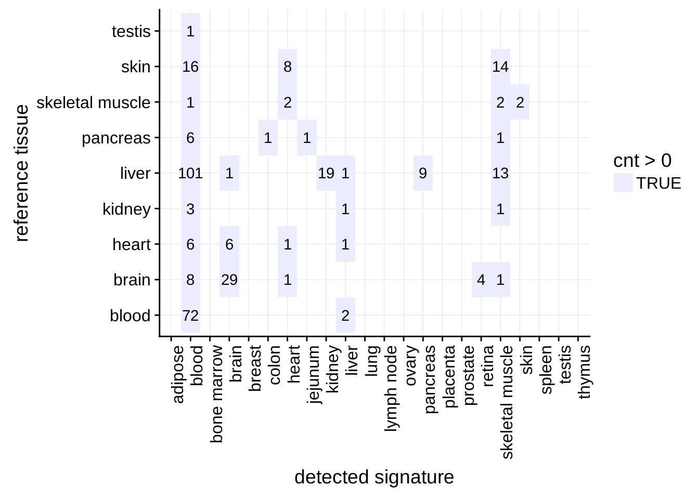
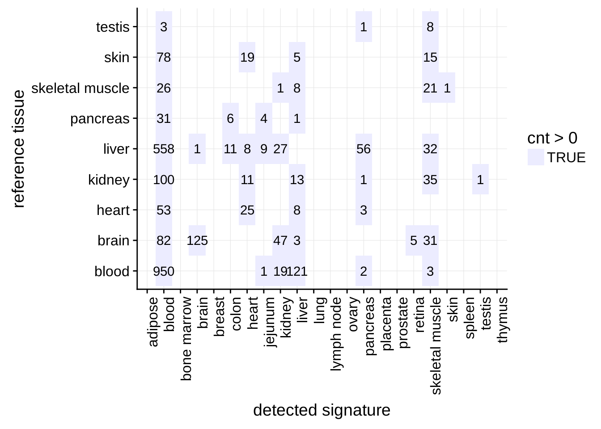

```r
library(dplyr)
```

```
## 
## Attaching package: 'dplyr'
```

```
## The following objects are masked from 'package:stats':
## 
##     filter, lag
```

```
## The following objects are masked from 'package:base':
## 
##     intersect, setdiff, setequal, union
```

```r
library(stringr)
library(readr)
source("../scripts/config.R")
library(cowplot)
```

```
## Loading required package: ggplot2
```

```
## 
## Attaching package: 'cowplot'
```

```
## The following object is masked from 'package:ggplot2':
## 
##     ggsave
```


# Figures for publication

## Contamination heatmaps


```r
load('../results/data_processed.RData')
load('../results/models.RData')

contam_count_array = data_corr %>%
  filter(pcorr_adj < P_THRES) %>%
  group_by(TGROUP, SIGNATURE) %>%
  summarise(cnt = n_distinct(GSM))
data_corr_array = data_corr

load('../results/archs4/archs4_data_processed.RData')
load('../results/archs4/archs4_models.RData')

contam_count_ngs = data_corr %>%
  filter(pcorr_adj < P_THRES) %>%
  group_by(TGROUP, SIGNATURE) %>%
  summarise(cnt = n_distinct(GSM))
data_corr_ngs = data_corr
```

same as in the section before, but all bioqc signatures aggregated by tissue groups.

```r
bioqc_tissue_set = read_csv("../data/bioqc_geo_oracle_dump/BIOQC_TISSUE_SET_DATA_TABLE.csv") %>%
  filter(TISSUE_SET == 'bioqc_all') %>%
  select(SIG_ID=SIGNATURE, DETECTED_TGROUP=TGROUP)
```

```
## Parsed with column specification:
## cols(
##   SIGNATURE = col_integer(),
##   TISSUE = col_character(),
##   TGROUP = col_character(),
##   TISSUE_SET = col_character()
## )
```

```r
bioqc_all = selected_signatures %>%
  filter(str_detect(SIGNATURE, 'BIOQC')) %>%
  pull("SIGNATURE")

contam_count_ngs_tgroup = data_corr_ngs %>%
  inner_join(bioqc_signatures, by=c("SIGNATURE"="SIG_NAME")) %>%
  rename(SIG_ID=ID) %>%
  inner_join(bioqc_tissue_set) %>%
  filter(pcorr_adj < P_THRES) %>%
  group_by(TGROUP, DETECTED_TGROUP) %>%
  summarise(cnt = n_distinct(GSM))
```

```
## Joining, by = "SIG_ID"
```

```r
contam_count_array_tgroup = data_corr_array %>%
  inner_join(bioqc_signatures, by=c("SIGNATURE"="SIG_NAME")) %>%
  rename(SIG_ID=ID) %>%
  inner_join(bioqc_tissue_set) %>%
  filter(pcorr_adj < P_THRES) %>%
  group_by(TGROUP, DETECTED_TGROUP) %>%
  summarise(cnt = n_distinct(GSM))
```

```
## Joining, by = "SIG_ID"
```


```r
tgroups = bioqc_tissue_set$DETECTED_TGROUP %>% unique()
contam_count_ngs_tgroup %>%
  ggplot(aes(x=factor(DETECTED_TGROUP, levels=tgroups), y=TGROUP)) +
      geom_tile(aes(fill = cnt > 0)) +
      geom_text(aes(label=cnt)) +
      theme(axis.text.x = element_text(angle = 90, hjust = 1)) +
      scale_x_discrete(drop=FALSE) +
      ylab("reference tissue") +
      xlab("detected signature") +
      background_grid() +
      scale_fill_manual(values=c("#ececff"))
```



```r
tgroups = bioqc_tissue_set$DETECTED_TGROUP %>% unique()
contam_count_array_tgroup %>%
  ggplot(aes(x=factor(DETECTED_TGROUP, levels=tgroups), y=TGROUP)) +
      geom_tile(aes(fill = cnt > 0)) +
      geom_text(aes(label=cnt)) +
      theme(axis.text.x = element_text(angle = 90, hjust = 1)) +
      scale_x_discrete(drop=FALSE) +
      ylab("reference tissue") +
      xlab("detected signature") +
      background_grid() +
      scale_fill_manual(values=c("#ececff"))
```




