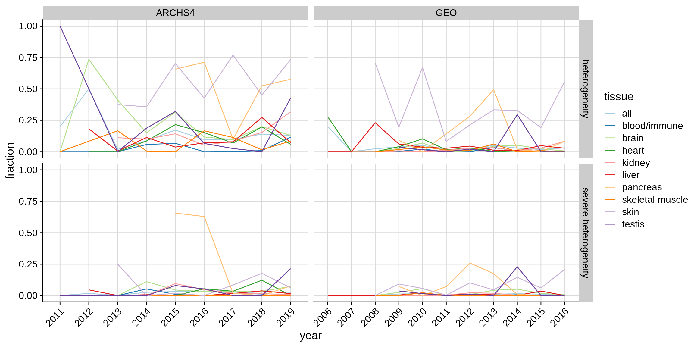

# Testing for tissue heterogeneity

## Tissue signatures {#sec:signatures}

In section \@ref(validating-signatures), we identified a set of
9 *reference signatures* (table \@ref(tab:refsig)) which unambiguously
identify their corresponding tissue across platforms and species. In addition to that, 
we use 120 tissue signatures from the BioQC publication, which we refer to as *query signatures*. 

Table: (\#tab:refsig)reference signatures

|Reference Signature  |Tissue          |NA                |
|:--------------------|:---------------|:-----------------|
|GTEX_Blood           |blood/immune    |blood             |
|GTEX_Blood           |blood/immune    |white blood cells |
|GTEX_Blood           |blood/immune    |pbmc              |
|GTEX_Brain           |brain           |brain             |
|GTEX_Brain           |brain           |cerebellum        |
|GTEX_Brain           |brain           |cortex            |
|GTEX_Brain           |brain           |frontal cortex    |
|GTEX_Brain           |brain           |prefrontal cortex |
|GTEX_Brain           |brain           |hippocampus       |
|GTEX_Brain           |brain           |hypothalamus      |
|GTEX_Heart           |heart           |heart             |
|GTEX_Kidney          |kidney          |kidney            |
|GTEX_Liver           |liver           |liver             |
|GTEX_Liver           |liver           |hepatocyte        |
|GTEX_Muscle_Skeletal |skeletal muscle |skeletal muscle   |
|GTEX_Pancreas        |pancreas        |pancreas          |
|GTEX_Skin            |skin            |skin              |
|GTEX_Testis          |testis          |testis            |

## Testing samples for heterogeneity

We tested for enrichment of 120
selected signatures provided by BioQC (query signatures) and the 9
reference signatures generated by us on all  76576
selected samples resulting in a list of 9878304 
(sample, signature, pvalue) pairs.

Our intention is to identify samples that show *tissue heterogeneity*,
*i.e.* unintentional profiling of cells of other origin than the target tissue
of profiling. We classify samples into *heterogeneous* and *not heterogeneous*.
We call a classification *true-positive* if the given sample is classified
as *heterogeneous* and the sample indeed contains cells different from the
annotated tissues. Analogous, we call a classification *false-positive*
if the given sample is classified as *heterogeneous* but in reality only contains cells from the annotated tissue.

Naively, we could label a sample as heterogeneous, if a signature unrelated
to the annotated tissue exceeds a certain score. The problem with this
approach is, that some signatures overlap; the resulting scores are therefore
correlated and will lead to false-positives. One cannot simply solve this
problem by excluding genes that are members of multiple signatures, as it is
easily possible to build two (in fact many) distinct, non-overlapping
signatures matching the same tissue, due to gene-gene correlation. 

In section \@ref(validating-signatures) we have created and validated
*reference signatures* for 9 tissues. Even though we have demonstrated that
each signature unambiguously identifies its corresponding tissue (*i.e.* scores
highest), the signatures could still be correlated. Some of them in fact are,
e.g. cardiac muscle and skeletal muscle (see figure
\@ref(fig:correlationexample)). Moreover, we lack sufficient data to perform an
independent-sample validation on the signatures provided by BioQC.  
Therefore, to avoid false-positives, for each tissue, we exclude all signature
that are positively correlated with the reference signature. This approach is
more formally described in the following: 

A given sample $s$ annotated as tissue $t$ is tested for enrichment with signature $k_{\text{query}}$ resulting in a p-value $p_{\text{query}}$. Let $k_{\text{ref}}$ be the reference signature associated with tissue $t$ and $p_{\text{ref}}$ the p-value of testing $s$ for enrichment of $k_{\text{ref}}$. Let $\tau$ be a certain false discovery rate (FDR)-threshold (0.01 in this study).

(1) If the Benjamini-Hochberg (BH)-adjusted $p_{\text{query}} \ge \tau$, we
assume that $s$ is not heterogeneous; else continue.
(2) We fit a robust linear model using `rlm` from the `R` `MASS` package of
$|log10(p_{\text{query}})|$ against $|log10(p_{\text{ref}})|$ for all samples
annotated as $t$. 
(3) If the slope of the linear model is  $\ge 0.01$, we exclude the pair of
signatures from the results. If the slope is $< 0.01$ and the FDR-adjusted $p_{\text{query}} < \tau$, 
we consider the sample as heterogeneous. Tissue pairs for which signatures are excluded are 
marked as such in the results. 
(4) We define heterogeneity as *severe*, if additionally $p_{\text{ref}} \ge$ 0.05. 

(\#fig:correlationexample)Examples of signature correlation. Panels A-B: scatterplot of the signature scores (y-axis) against the scores of a reference signature (x-axis). The black line indicates the model fitted to the data. Points are colored according to the called heterogeneity status. (A) Skeletal muscle scores of kidney samples against scores of the kidney signature. The samples are not correlated, however some outliers are detected which are samples likely containing muscle cells. (B) Skeletal muscle scores of cardiac muscle samples against skeletal muscle scores. The scores are highly correlated. While most of the points exceed the FDR threshold, they will not be classified as heterogeneous since the signatures are correlated. Panels C and D show the boxplots of the scores of various signatures on kidney and heart samples, respectively. 

<!-- Boxplots and scatterplots of all combinations for manual inspection -->

<!-- Make main figure --> 

<!-- Export heterogeneity statistics to TSV files -->

\clearpage

# Additional Results

## Distribution of heterogeneity across studies

Figure \@ref(fig:heterogeneitystudy) shows that heterogeneity is not equally distributed along studies. In fact, most studies (84.9% GEO, 74.7% ARCHS4) contain no samples with detected heterogeneity and only a small percentage (5.7% GEO, 7.3% ARCHS4) contain "severely heterogeneous" samples. 

(\#fig:heterogeneitystudy)Beeswarm plot depicting the fraction of heterogeneous samples and severely heterogeneous samples for each study. 

## Heterogeneity along time

Next, we were interested if heterogeneity increases over time. Figure \@ref(fig:hetereogeneityyear) shows the heterogeneity fractions 
per year and tissue. While there is some variance between years, there appears to be no clear trend over time. 

(\#fig:hetereogeneityyear)Fractions of heterogeneous and severely heterogeneous samples by year.

To formally test the hypothesis that heterogeneity is associated with a time variable, we fitted a linear model (`heterogeneity ~ year + tissue`)
and checked the `year` coefficient (table \@ref(tab:yearlmres)). There appears to be no significant association of time with heterogeneity. 

Table: (\#tab:yearlmres)The time coefficient of a linear model explaining heterogeneity by year and tissue

|dataset |type                 |      slope|   p-value|
|:-------|:--------------------|----------:|---------:|
|ARCHS4  |heterogeneity        | -0.0048787| 0.6042316|
|ARCHS4  |severe heterogeneity | -0.0012819| 0.8091536|
|GEO     |heterogeneity        | -0.0031032| 0.4313845|
|GEO     |severe heterogeneity |  0.0015394| 0.3646752|

\clearpage

# References
