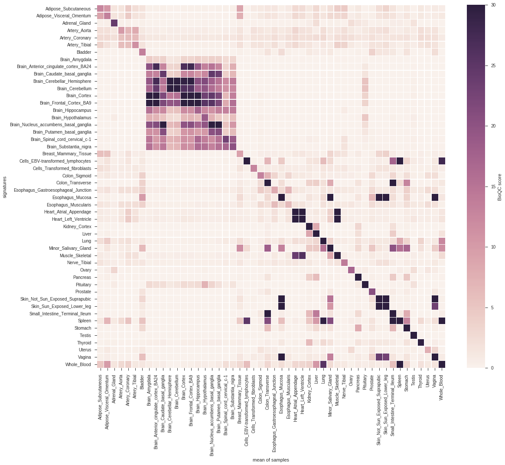
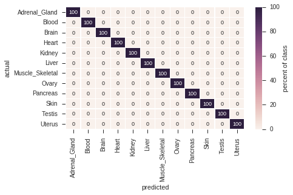
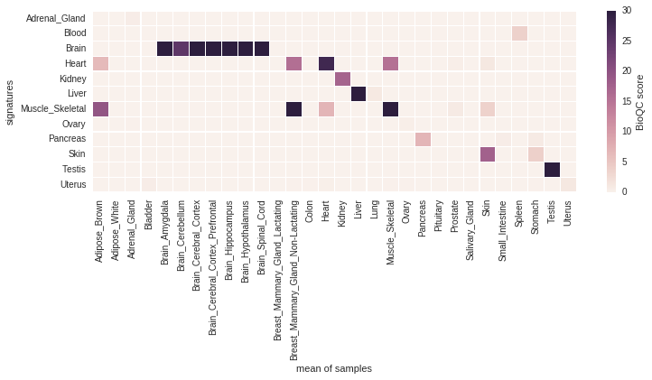

---
output:
  pdf_document: default
bibliography: bibliography.bib
biblio-style: apalike
link-citations: yes
colorlinks: yes
---

\newpage 

# Validating Tissue Signatures {#validating-signatures}

The authors of *BioQC* have taken three independent approaches
to show that their signatures are valid and biologically meaningful [@bioqc].
(1) They checked the results for batch effects using surrogate
variable analysis, (2) they ensured that the signatures
are biologically meaningful by relating them to biological knowledge,
and (3) used an independent method to derive the signatures, which yields comparable results.

However, they do not quantify the performance of the signatures using
standardized performance measures, such as sensitivity and specificity.
In principle, one can think of three methods to achieve such a
validation [@Gonen2009]: (1) internal validation, *i.e.* using the same
data for generating and testing signatures, (2) split-sample validation,
*i.e.* dividing the dataset in a test and training dataset and (3)
independent-sample validation, *i.e.* using entirely unrelated samples
for training and testing. While method (2) might be acceptable if
sufficient data is unavailable, only method (3) can ensure that the
signature does not reflect experimental biases.

To address this, we independently derived signatures on the
[GTEx](http://gtexportal.org) [@gtex] dataset using *gini-index* as 
[described previously](https://www.ncbi.nlm.nih.gov/pmc/articles/PMC5379536/) [@bioqc] and performed
both a 10-fold cross validation on the same dataset and a cross-species,
cross-platform validation on the [mouseGNF GeneAtlas](https://www.ncbi.nlm.nih.gov/geo/query/acc.cgi?acc=GSE10246) [@Lattin2008].
To this end, we developed the python package [pygenesig](https://github.com/grst/pygenesig) ^[https://github.com/grst/pygenesig],
a framework to create and validate signatures.

In this chapter, we

 * perform a 10-fold cross-validation on the GTEx dataset, calculating the precision and recall for each signature.
 * perform a cross-species, cross-platform validation of the signatures generated on the GTEx dataset
 * identify a set of tissues, that can be reliably and unabmigously identified with the *BioQC* method.


## Data
 * The [**Genotype Tissue Expression (GTEx)**](http://gtexportal.org) project [@gtex] is a comprehensive resource of tissue-specific gene expression data. We use this dataset to derive tissue-specific signatures. The data is human only and was generated using Illumina sequencing.
 * We use the [**GNF Mouse GeneAtlas V3**](https://www.ncbi.nlm.nih.gov/geo/query/acc.cgi?acc=GSE10246) [@Lattin2008] as a control dataset to demonstrate that the gini-method is robust over multiple platforms and species. This dataset originates from mouse and was generated using the *Affymetrix Mouse Genome 430 2.0 Array (GPL1261)*.

## Cross-Validation of signatures on the GTEx dataset
We use *pygenesig* to create and validate signatures on the GTEx v6 dataset. The data preparation steps are performed using [these jupyter notebooks](https://github.com/grst/pygenesig-example/tree/d88e4a81a45e192527a84a4445094604deba580b/notebooks/prepare_data) ^[https://github.com/grst/pygenesig-example/tree/d88e4a81a45e192527a84a4445094604deba580b/notebooks/prepare_data]. The output of *pygenesig* can be viewed [here](https://github.com/grst/BioQC_GEO_analysis/blob/aa0fcd86bbdfbd49c9a4a10ce0be1c22895cc957/notebooks/gtex_v6_gini.ipynb) ^[https://github.com/grst/BioQC_GEO_analysis/blob/aa0fcd86bbdfbd49c9a4a10ce0be1c22895cc957/notebooks/gtex_v6_gini.ipynb]. Below, we summarize the analyses described in these documents.

We obtained the gene expression data and sample annotation from the [GTEx portal](http://gtexportal.org). We collapsed gene 
expression data by HGNC symbol, aggregating by the sum. We aggregated samples of the same tissue by median. 
We generated signatures based on [gini index](https://grst.github.io/pygenesig/apidoc.html#module-pygenesig.gini) ^[https://grst.github.io/pygenesig/apidoc.html#module-pygenesig.gini] as described in the [BioQC paper](https://www.ncbi.nlm.nih.gov/pmc/articles/PMC5379536/) [@bioqc]. In brief, we calculated gini index for each gene across all tissues. Genes with a gini index >= 0.8 and expression of >= 5 TPM were added to the signatures of the 3 tissues with their highest expression. 

Next, we performed a 10-fold cross-validation as follows:
We split samples in 10 [stratified folds](http://scikit-learn.org/stable/modules/generated/sklearn.model_selection.StratifiedKFold.html) ^[http://scikit-learn.org/stable/modules/generated/sklearn.model_selection.StratifiedKFold.html], *i.e.* samples from all tissues are equally distributed across all folds. We use 9 folds to generate signatures. These signatures were applied to the remaining fold using BioQC. We iterated over the folds such that each fold has been used for training and testing.

Figure \@ref(fig:gtexxval) shows the average BioQC score over all folds for each signature and each tissue.

```{r gtexxval, echo=FALSE, fig.cap="cross-validation of GTEx tissue signatures. Signatures are shown on the y-axis, the corresponding groups of samples on the x-axis. The tile shading indicates the average BioQC score of a signature on a group of samples. For better visibility of low scores, the colors are saturated at 30.", out.width="100%", fig.align="center", fig.pos="p"}

```

As identifying contaminated/mislabled samples can be boiled down to a classification problem, we are interested in the predictive performance of each signature. Figure \@ref(fig:gtexxvalclass) shows the confusion matrix of using the signatures for classification. A sample is considered as classified as a tissue, if the corresponding signature scores highest among all other signatures.

```{r gtexxvalclass, echo=FALSE, fig.cap="Confusion matrix of the cross-validation.", out.width="100%", fig.align="center", fig.pos="p"}
knitr::include_graphics("signature_validation/gtex_v6_xval_classification.png")
```

## Reference Signatures
From the above matrices we learn that, while the vast majority of signatures yield a high score in the corresponding tissue, an unambiguous classification of tissues is only viable for a subset of tissues.
For instance, the different brain regions are hard to distinguish, and so are physiologically close tissues (e.g. large and small intestine).

Here, we reduce the dataset to a subset of tissues, which can be unambigously distinguished using the BioQC method (*i.e.* precision = recall = 1.0).

We [manually map](https://github.com/grst/pygenesig-example/blob/d88e4a81a45e192527a84a4445094604deba580b/manual_annotation/gtex_solid.csv) ^[https://github.com/grst/pygenesig-example/blob/d88e4a81a45e192527a84a4445094604deba580b/manual_annotation/gtex_solid.csv]
the tissues from GTEx to a reduced subset of tissue names. The results are available in [this jupyter notebook](https://github.com/grst/BioQC_GEO_analysis/blob/b11987da13ba9b98eba34206f92942be8de6427e/signature_validation/gtex_v6_gini_solid.ipynb) ^[https://github.com/grst/BioQC_GEO_analysis/blob/b11987da13ba9b98eba34206f92942be8de6427e/signature_validation/gtex_v6_gini_solid.ipynb]
and summarized below.

Figure \@ref(fig:gtexconfmat) shows the confusion matrix of the reduced signature set. All tissues have been correctly identified at precision = recall = 1.0.

```{r gtexconfmat, echo=FALSE, fig.cap="Confusion matrix of robust signatures. ", out.width="50%", fig.align="center", fig.pos="htbp"}

```


## Cross-Platform Cross-Species Validation
To asses if the signatures translate across species and platforms, we tested the signatures generated above (human, Illumina sequencing) on the *mouseGNF tissue expression atlas* (mouse, Affymetrix microarray). The procedure is described in [this notebook](https://github.com/grst/pygenesig-example/blob/80bfe2a388a5230b004c288cb2ea220f0394855d/notebooks/gtex_solid_vs_mouse_gnf.ipynb) ^[https://github.com/grst/pygenesig-example/blob/80bfe2a388a5230b004c288cb2ea220f0394855d/notebooks/gtex_solid_vs_mouse_gnf.ipynb].

Figure \@ref(fig:xspeciesval) shows the score matrix of GTEx signatures against mouseGNF samples. 

```{r xspeciesval, echo=FALSE, fig.cap="Cross-platform, cross-species validation of the robust signatures identified in the previous step.", out.width="70%", fig.align="center", fig.pos="htbp"}

```

The signatures *Brain, Heart, Kidney, Liver, Skeletal Muscle, Pancreas, Skin* and *Testis* identify the respective tissue despite the species and platform differences at a high (>5) BioQC score.

As expected *Heart* and *Skeletal muscle* also identify each other, however *Heart* scores are still higher on heart samples and *Skeletal muscle* scores are higher on skeletal muscles samples, therefore we retain both signatures.

Surprisingly, *Adrenal Gland*, *Ovary* and *Uterus* are not able to identify the respective samples, despite having a high score in the cross-validation. We, therefore, exclude these signatures from the reference signature set.

Unfortunately, *Blood* was not profiled in the mouseGNF dataset. We keep the signature nonetheless as it does not trigger any false positives.

\newpage
